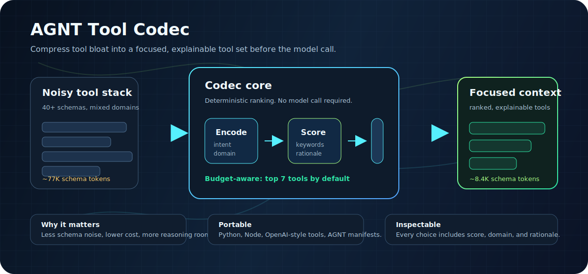
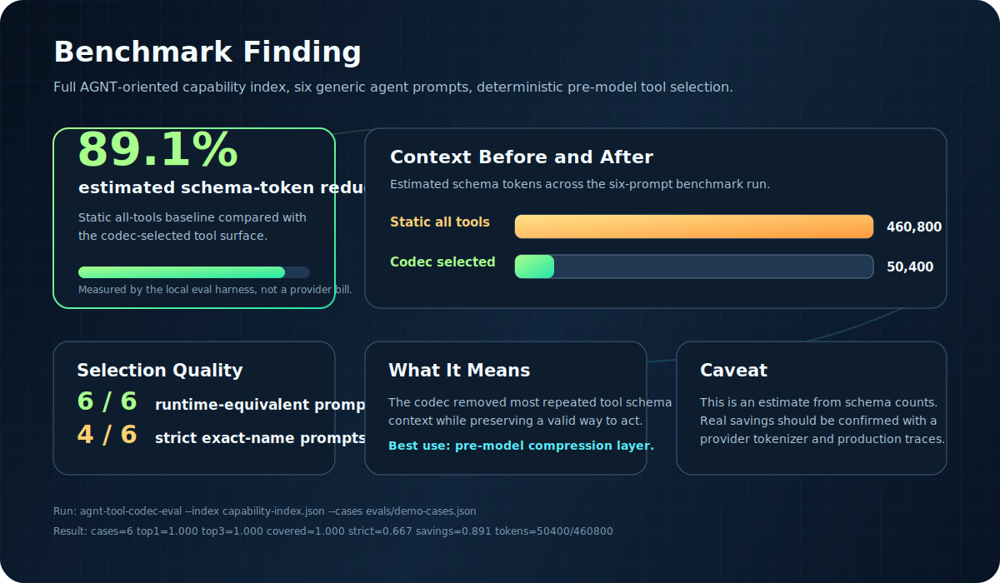

# AGNT Tool Codec

Intent-aware tool selection for agent runtimes.

AGNT Tool Codec reads a user message, scores your available tools, and returns a small ranked shortlist. Instead of sending every tool schema to the model on every turn, your agent can send only the tools that are likely to matter.



## Why This Exists

Modern agents accumulate tools quickly: web search, file access, code execution, memory, GitHub, databases, calendars, payments, internal APIs, and custom plugins. Passing all of those schemas into every model call is expensive and noisy.

The codec gives the orchestration layer a simple preflight step:

```python
result = codec.select("push these changes to GitHub")
```

Result:

```json
{
  "selected": [
    { "tool": "github-plugin", "score": 0.821 },
    { "tool": "execute-javascript-code", "score": 0.15 }
  ],
  "metadata": {
    "tokenEstimate": 8400,
    "withinBudget": true,
    "savingsPercent": 89
  }
}
```

## What It Does

AGNT Tool Codec uses deterministic scoring. No model call is required.

It looks at:

| Signal | Purpose |
| --- | --- |
| Intent | Is the user trying to search, create, analyze, fix, deploy, monitor, or configure? |
| Domain | Is the task about development, data, finance, communication, science, or system operations? |
| Keywords | Do message words match tool keywords, titles, plugin names, or descriptions? |
| Budget | How many tool schemas fit inside the configured token budget? |
| Fallbacks | Which safety tools should still be available when relevant tools are sparse? |

Default budget:

```text
7 tools x ~1,200 schema tokens = ~8,400 tokens
```

That keeps the selected set below the default `8,700` token budget while leaving far more context for reasoning and task data.

## Repository Layout

```text
.
|-- README.md                         # Product overview and quick start
|-- .github/workflows/ci.yml          # Python/Node/build CI
|-- capability-index.json             # AGNT-oriented capability manifest
|-- config.json                       # Weights, intent patterns, budget, fallbacks
|-- tool-codec.mjs                    # Small standalone Node runner
|-- tool-codec.js                     # Node library and CLI
|-- codec-integration.js              # AGNT-oriented integration module
|-- build-index.js                    # Manifest scanner for capability indexes
|-- dashboard.html                    # Local visual dashboard for selection logs
|-- src/
|   `-- agnt_tool_codec/
|       |-- core.py                   # Dependency-free Python scoring core
|       |-- adapters.py               # OpenAI/callable adapter helpers
|       |-- cli.py                    # agnt-tool-codec-py
|       |-- eval.py                   # agnt-tool-codec-eval
|       `-- data/demo-index.json      # Built-in try-it-now capability index
|-- docs/
|   |-- scoring.md                    # Language-neutral scoring contract
|   `-- assets/                       # README graphics
|       |-- codec-flow.svg            # Flow graphic
|       `-- benchmark-findings.svg    # Benchmark summary graphic
|-- spec/
|   `-- capability-index.schema.json  # Capability index schema
|-- evals/
|   `-- demo-cases.json               # Demo eval prompts and expected tools
|-- examples/
|   |-- python_cli.py                 # Basic Python package usage
|   |-- openai_adapter.py             # OpenAI-style tool filtering example
|   `-- generic_runtime.py            # Dict-tool filtering for custom runtimes
|-- tests/
|   `-- test_python_codec.py          # Python unit tests
`-- test-codec.js                     # Node smoke suite
```

## Before You Install

Use the codec when your agent runtime has enough tools that schema noise becomes a real cost. If your agent only has three or four tools, you probably do not need this yet.

The codec expects a capability index:

```json
{
  "version": "1.1.0",
  "tools": [
    {
      "name": "github-plugin",
      "domain": "development",
      "intents": ["deploy", "search"],
      "keywords": ["github", "git", "push", "repository"],
      "description": "Interact with GitHub repositories"
    }
  ]
}
```

You can use the included `capability-index.json`, generate one from AGNT plugins, or produce your own from another framework.

## Python

Install locally:

```bash
python -m pip install -e .
```

Try it without building a capability index:

```bash
agnt-tool-codec-py --demo --names "push these changes to github"
```

Run the CLI:

```bash
agnt-tool-codec-py --index capability-index.json --config config.json "create a new plugin for monitoring"
```

Use as a library:

```python
from agnt_tool_codec import ToolCodec

codec = ToolCodec.from_files("capability-index.json", "config.json")
result = codec.select("search for current AI news")

for tool in result["selected"]:
    print(tool["tool"], tool["score"], tool["rationale"])
```

Filter OpenAI-style tool schemas:

```python
from agnt_tool_codec import filter_openai_tools

filtered_tools, report = filter_openai_tools(
    "push these changes to github",
    openai_tools,
)
```

Filter any simple dict-based tool list:

```python
from agnt_tool_codec import filter_dict_tools

tools = [
    {"name": "web_search", "description": "Search the web."},
    {"name": "send_slack", "description": "Send a Slack message."},
]

filtered_tools, report = filter_dict_tools("send the team an update", tools)
```

Build metadata from Python callables:

```python
from agnt_tool_codec import capability_from_callable, select_tools

def query_database():
    """Query SQL customer records."""

capabilities = [capability_from_callable(query_database)]
print(select_tools("find customer records", capabilities)["selected"])
```

## Node

Run the standalone selector:

```bash
node tool-codec.mjs "check system health"
```

Run the richer CLI:

```bash
node tool-codec.js --query "push changes to github"
```

Import from Node:

```js
import { runCodec } from "./tool-codec.js";

const result = runCodec("validate the golden ratio claim");
console.log(result.selected);
```

## AGNT Integration

AGNT can call `codec-integration.js` before final tool injection:

1. Read the latest user message.
2. Score tools against `capability-index.json`.
3. Keep the top ranked tools under the token budget.
4. Merge with AGNT's required default/fallback tools.
5. Send the compact schema set to the model.

The codec is a selector, not an authority layer. Your orchestrator still decides which tools are allowed, which tools are safe, and which tools are required for the current surface.

## Configuration

```json
{
  "maxTools": 7,
  "minThreshold": 0.15,
  "tokenBudget": 8700,
  "domainBoost": 0.15,
  "historyBoost": 0.10,
  "fallbackTools": [
    "execute_javascript",
    "web_search",
    "file_operations"
  ]
}
```

Tune the codec by changing:

| Field | Effect |
| --- | --- |
| `maxTools` | Hard cap on selected tools |
| `minThreshold` | Minimum score required for inclusion |
| `tokenBudget` | Target schema-token budget |
| `intentPatterns` | Words that identify user intent |
| `domains` | Words that identify task domain |
| `fallbackTools` | Tools returned as fallback suggestions |

## Validation

Run all local checks:

```bash
npm test
python -m unittest discover -s tests -v
agnt-tool-codec-eval --cases evals/demo-cases.json
```

Current local baseline:

```text
Node smoke suite: 22/22 passing
Python unit suite: 9/9 passing
Demo eval: reports top-1/top-3/coverage metrics
Default selection budget: 8,400 / 8,700 tokens
```

## Measuring Context Bloat

The eval runner reports estimated schema-token savings for every prompt. The
graphic below summarizes the larger AGNT-oriented index run:



```bash
agnt-tool-codec-eval --index capability-index.json --cases evals/demo-cases.json
```

You can also run the smaller built-in demo index:

```bash
agnt-tool-codec-eval --index src/agnt_tool_codec/data/demo-index.json --cases evals/demo-cases.json
```

Example output:

```text
cases=6 top1=1.000 top3=1.000 covered=1.000 strict=1.000 savings=0.583 tokens=18000/43200
OK | push these changes to github -> github, execute_python | saved=4800
```

The default estimate is intentionally simple:

```text
static tokens   = all tools x 1,200
selected tokens = selected tools x 1,200
tokens saved    = static - selected
```

That makes the benchmark dependency-free and easy to run anywhere. For production reporting, plug in your tokenizer of choice and compare the same two surfaces: all schemas versus codec-selected schemas.

On the built-in demo index, the current demo cases save an estimated 58.3% of
schema tokens while preserving 100% strict top-3 coverage. On the larger
AGNT-oriented index, the same generic cases save an estimated 89.1% of schema
tokens while preserving 100% top-3 coverage when runtime-equivalent tools are
allowed. Strict exact-name coverage is 66.7%, which is useful signal: some
runtimes have equivalent tools with different names.

That is the point of the benchmark: it shows both savings and selection quality,
so metadata gaps become visible instead of hidden behind a single token-savings
number.

## What We Learned

- Context bloat is measurable. On the full AGNT-oriented index, the benchmark
  compares 460,800 estimated static schema tokens against 50,400 selected schema
  tokens across six prompts.
- Token savings alone are not enough. A selector can save 89% of schema tokens
  and still be wrong if the capability index is thin or mismatched.
- Exact-name evals and runtime-equivalent evals answer different questions.
  Strict coverage tells you whether a specific named tool was selected.
  Equivalent coverage tells you whether the runtime still has a valid way to do
  the job.
- Metadata quality is the ceiling. Adding `files`, `repo`, `repository`,
  `source`, and `inspect` to `file-operations` moved "inspect files in this
  repo" from a miss to a top-1 hit on the AGNT index.
- The codec is most useful as a pre-model compression layer, not as a permission
  system. It should recommend a compact tool surface; the host runtime should
  still enforce safety, policy, and authorization.

## Design Principles

- Deterministic first: no model call is required to rank tools.
- Portable core: the scoring contract is independent of AGNT.
- Runtime-owned safety: the codec recommends tools; the host runtime enforces permissions.
- Small context: selected tools should stay under budget by default.
- Inspectable output: every selected tool includes a score and rationale.

## License

Apache-2.0. See `LICENSE`.
